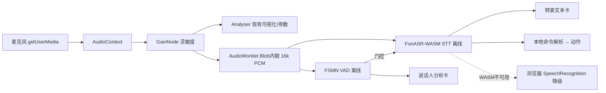

# AlphaSun 声波分析仪 · 语音能力增量 PRD（v1.1 增量）

> **【归档文档 · 非待办】**（归档于 v2.21.0）
> 本文是**离线 WASM STT 路线的历史需求文档**，保留供决策追溯，**不代表当前待办**。
> 实际落地路线已调整为**云端优先 + 自动降级**（见下方「归档说明」），本文的「纯离线 WASM」方案**大部分未采用**。
> 当前的语音转写实现与现状说明请见 `README.md` 音频工具集章节与 `docs/架构说明.md` 2.7 节。

## 归档说明（v2.21.0 补记）

本文提出的「离线 WASM STT + VAD + 说话人分析 + 语音命令」增量，最终**没有按本文的纯离线路线实现**，原因与实际落地如下：

| 本文设想 | 实际落地（v2.15.0 → v2.21.0） |
|---|---|
| 离线 WASM STT（SenseVoice/Whisper） | 改为**云端 DashScope（阿里云百炼）为主 + 本地 Vosk 为辅**，见 `README.md`。原因：离线模型体积大（数十至数百 MB）、Vosk 无官方粤语模型、中文识别准确率明显不如云端大模型 |
| 「移动端离线 WASM」 | 改为**移动端同样走云端/浏览器 Web Speech**，并通过 `auto` 模式自动选择最优可用引擎 |
| 语音命令 / 唤醒词 | **未实现**（优先级最低，用户未要求） |
| 说话人分析（diarization）增强 | 主界面的「人声子分析（性别/人数/基频起伏）」沿用既有实现，未做轻量 diarization |

> 本文中「待确认问题清单」（模型体积上限、移动端离线策略、命令词表、唤醒词、多语种、隐私声明措辞）**均已由实际决策绕过或降级**，
> 保留原文仅作历史参考。粤语「只能走云端」这一硬约束已在 `docs/架构说明.md` 2.7 节记录。

---

> 作者：许清楚（产品经理） ｜ 项目署名：阳光 net2net2net（VX：net2net）
> 离线优先 · 国产优先 · 单一真源（只改 `index.html`，`npm run sync` 自动覆盖全平台）

---

## 1. 产品目标（一句话）

让全平台（Windows / macOS / Linux / Android / iOS / HTML-PWA）在**完全离线、音频不出本机**的前提下，具备「中文语音实时转写 + 人声/说话人增强分析 + 离线语音命令」三项能力，且所有改动只落在单一真源 `index.html`。

## 2. 本次增量范围（仅变更，不重复已有能力）

- **新增**：离线 WASM STT 引擎接入（替换/增强现有仅 Chrome 在线的 `SpeechRecognition`）。
- **新增**：VAD 语音活动检测、说话人分析增强（性别/人数/轻量 diarization）、命令词解析与唤醒。
- **新增 UI**：右侧 480px 面板内的「转录文本」「说话人分析」「语音命令状态条」。
- **不变**：4 种可视化、灵敏度 GainNode、专业参数、离线启发式分类主体、IndexedDB 报告、中央环暂停逻辑、单一真源与 `npm run sync` 同步机制。
- **边界**：不引入任何运行时 CDN / 网络请求；不将音频上传任何服务器；不修改 `www/` 或各平台产物（仅改 `index.html` 及可引用的本地 `assets/` 资源）。

## 3. 用户故事（含优先级）

| # | 能力 | 用户故事（As a… I want… so that…） | 优先级 |
|---|------|-----------------------------------|--------|
| US1 | 语音转写 | As a 全平台用户，I want 说话时中文实时转成文字且无需联网/不上传音频，so that 可在隐私敏感场景离线记录语音内容。 | **P0** |
| US2 | 人声/说话人分析 | As a 分析师，I want 看到语音活动、性别、人数及大致说话人区分（diarization-lite），so that 离线判断"谁在说、几个人"。 | **P0(VAD) / P1(增强)** |
| US3 | 语音命令 | As a 双手占用用户，I want 用唤醒词+指令离线操控采集/切换/导出，so that 无需触碰屏幕即可操作。 | **P1(命令) / P2(专用唤醒词)** |

## 4. 需求池（P0 / P1 / P2）

### P0（必须 · 首版交付）
| 需求 | 说明 | 验收标准 | 平台覆盖 |
|------|------|----------|----------|
| R-STT-P0 | 接入离线 WASM STT（国产 FunASR-WASM；桌面 SenseVoice-small int8 ≈230MB，或 FunASR-Nano ≈50MB） | 中文实时转写零网络；桌面+HTML 跑通；首字延迟 < 1.5s | 桌面(Win/Linux/mac) + HTML |
| R-FALLBACK-P0 | 保留浏览器 `SpeechRecognition` 仅作降级兜底，WASM 不可用时自动切换 | 检测 WASM 初始化失败→降级；状态栏显示当前模式（离线 / 在线兜底） | 全平台（Chromium 系） |
| R-VAD-P0 | 接入 FSMN VAD（<4MB）驱动语音活动状态并门控 STT | VAD 状态实时显示；非语音段不触发转写；全平台可跑 | 全平台 |
| R-UI-P0 | 右侧面板新增转录卡 / 说话人卡 + 命令状态条 | 三块 UI 在 1920×1080 内聚且不挤压现有卡片 | 全平台 |
| R-ARC-P0 | 单一真源：新增代码在 `index.html`（或 `assets/` 本地 JS/模型）；`npm run sync` 自动覆盖全平台 | `index.html` 内无外部 URL；`npm run sync` 成功 | 全平台 |

### P1（应该 · 增强体验）
| 需求 | 说明 | 验收标准 | 平台覆盖 |
|------|------|----------|----------|
| R-GENDER-P1 | 在现有基频性别基础上加入共振峰（F1/F2）分析 | 性别判定优于纯基频；男女临界更准确 | 全平台 |
| R-COUNT-P1 | 基于 F0/共振峰轨迹聚类的"人数(估)" | 能区分 1 人 vs 2+ 人 | 全平台 |
| R-CMD-P1 | VAD 触发短语 → STT → 本地关键词命令解析（开始/暂停/切换可视化/灵敏度±/导出报告） | 离线说出指令触发对应动作；无需 LLM | 全平台 |
| R-DIAR-P1 | diarization-lite：对转录分段打说话人标签（A/B/C） | 多说话人时按段标注说话人 | 桌面优先 |

### P2（可选 · 后续增强）
| 需求 | 说明 | 验收标准 | 平台覆盖 |
|------|------|----------|----------|
| R-MULTI-P2 | 多语种切换（zh/en） | 语种开关可用 | 全平台 |
| R-CUSTCMD-P2 | 用户自定义命令词表 | 可增删命令映射 | 全平台 |
| R-WAKE-P2 | 专用轻量唤醒词 WASM（替代 STT 关键词匹配） | 低功耗常驻唤醒；误唤醒率可接受 | 桌面 → 移动 |
| R-DIAR-EMB-P2 | 接入 CAM++ 说话人向量（≈27MB）提升区分度 | 多人区分更准确 | 桌面 |

## 5. 关键决策：STT 引擎选型

### 候选对比
| 方案 | 离线 | 国产 | 中文能力 | 模型体积 | 移动可行 | 成熟度 |
|------|------|------|----------|----------|----------|--------|
| (a) 浏览器 SpeechRecognition | ✗（需网） | ✗ | 依赖 Google | 0（云端） | Chromium 系 | 高（现状） |
| (b1) FunASR-WASM · SenseVoice-small (int8) | ✓ | ✓（达摩院） | 强（中/粤/日英韩） | ≈230MB | 勉强（重） | 中 |
| (b2) FunASR-WASM · FunASR-Nano | ✓ | ✓（达摩院） | 中（31 语种） | ≈50MB | 好 | 中 |
| (b3) WeNet-WASM | ✓ | ✓（清华） | 强（中英） | 中等 | 一般 | 低（浏览器生态弱） |
| (b4) Whisper（transformers.js, base） | ✓ | ✗（OpenAI） | 基础 | ≈80MB | 好 | 高（最成熟） |

### VAD 单独结论（同一 FunASR 生态）
**FSMN VAD 仅 <4MB**，离线、国产、全平台可跑——足以廉价满足 R-VAD-P0，且与 STT 同源，无需额外引擎。

### 推荐方案
1. **VAD 必选 FunASR FSMN VAD（<4MB）**——离线、国产、全平台、几乎零成本。
2. **STT 主引擎：FunASR-WASM**。桌面/HTML 用 **SenseVoice-small int8（≈230MB）**保中文精度；若体积/性能压力大，改用 **FunASR-Nano（≈50MB）**兼顾移动。
3. **STT 次级离线兜底：Whisper（base, ≈80MB, transformers.js）**——仅当 FunASR-WASM 集成遇阻塞时启用（国际方案，但仍 100% 离线）；体积比 SenseVoice 小、浏览器最成熟。
4. **最后降级：浏览器 SpeechRecognition**（现状保留），仅 Chromium 系且 WASM 不可用时。
5. **WeNet-WASM 暂列观察**：国产但浏览器 WASM 生态弱、文档少，不首选。

### 模型体积 / 性能 / 移动权衡
- **桌面（Electron）**：SenseVoice 230MB 或 Nano 50MB 均可流畅跑（ORT-WASM + SIMD/线程；可切 WebGPU）。
- **移动（Android/iOS WebView）**：WASM 性能弱于桌面；Nano 50MB 或 Whisper base 80MB 更现实；SenseVoice 230MB 发热/内存风险高。
- **经验红线**：移动端 ≤500MB 才合理（含 ORT wasm ≈15MB）。
- **打包**：模型与 ort wasm 以**本地资源**入 `assets/`，由 `sync-www.js`（拷贝 `assets`）与 `package.json` `build.files: ["assets/**"]` 随 `npm run sync` 自动进 `www/` 与各安装包，**不运行时下载**。

### 渐进路线是否可行
**可行且推荐为 Phase 1**：
- 首版：桌面（Win/Linux/mac）+ HTML 走离线 FunASR-WASM；移动（Android/iOS）沿用浏览器识别（在线兜底）直至 WASM 性能验证；**浏览器识别始终作为最终降级**。
- 实现风险（非阻塞）：Electron `file://` 下 ORT wasm 加载需 `webSecurity:false` 或自定义协议；用 **Blob-URL AudioWorklet**（将 worklet 代码以 `Blob` 内联）喂 16k PCM，保持单一真源且兼容 `file://` 与 WebView。

## 6. UI 设计稿（基于现有 1920×1080 双列布局）

现有 `.stage` 为 `1fr 480px`：左 = 可视化，右 = 480px 分析面板（卡片双列聚拢）。增量三块**内聚进右侧面板**（不出新区域，保证一屏）：

```
┌─────────────────────────────┬──────────────────────────┐
│  [可视化 canvas · 4 种效果]   │ 右侧 480px 面板（滚动）    │
│  中央环 = 暂停/继续           │ ┌─ 智能分类（现有）──────┐ │
│  dBFS / BPM / 电平           │ │ 人声/音乐/噪音 + 性别/人数│ │
│                             │ └────────────────────────┘ │
│                             │ ┌─ 转录文本（新增·P0）────┐ │
│                             │ │ 🎤 实时转写(流式)        │ │
│                             │ │ "今天天气不错……" 时间戳  │ │
│                             │ └────────────────────────┘ │
│                             │ ┌─ 说话人分析（新增·P0/P1）┐│
│                             │ │ VAD:●活动中 性别:男 人数:2│ │
│                             │ │ 说话人: A│B│C 聚类条     │ │
│                             │ └────────────────────────┘ │
│                             │ ┌─ 动作/事件日志（现有）──┐ │
│                             │ └────────────────────────┘ │
└─────────────────────────────┴──────────────────────────┘
 顶部工具栏：新增「语音模式」开关 + 命令状态 chip（聆听中 / 已唤醒 / 指令✓）
```

- **转录文本卡**：滚动文本 + 毫秒时间戳；流式（临时）与定稿分离；复用现有 `.card` 样式。
- **说话人分析卡**：VAD 指示灯 + 性别 + 人数(估) + 说话人标签 A/B/C（diarization-lite）。
- **命令状态条**：工具栏 chip 显示「🎤聆听 / 唤醒词命中 / 指令执行」；无需独立大区。
- 窄屏（<1100px）维持现有单列滚动，三卡自然下移。

### 音频 / 数据流水线



## 7. 待确认问题清单（请用户拍板）

1. **模型体积上限**：接受安装包增大多少？SenseVoice 230MB / Nano 50MB / Whisper 80MB 三选倾向？（影响是否桌面/移动同模型）
2. **移动端离线策略**：是否接受首版「桌面离线 WASM + 移动先用浏览器识别（在线兜底）」，还是强求移动也必须离线 WASM（承担体积/发热风险）？
3. **命令词表范围**：首批内置哪些指令？（建议：开始/暂停采集、切换可视化、增大/减小灵敏度、导出报告、清空历史）是否允许用户自定义？
4. **唤醒词**：用现成中文词（如"小阳""阿尔法"）经 STT 关键词匹配实现（零额外模型），还是后续接专用轻量唤醒词 WASM？
5. **多语种**：首版仅中文，还是同步英文/粤语？
6. **隐私声明措辞**：footer 现写「语音转写依赖浏览器内置 SpeechRecognition（Chrome+网络）」，需改为「本地离线识别」，请确认新表述。

## 8. 单一真源声明（重要）

- 本增量**全部新增代码写入 `index.html`**（WASM 模型 / ort wasm / 可选 worklet 以本地 `assets/` 资源引用；经 Blob-URL 内联 worklet 保持单文件友好）。
- 不修改 `www/`、`android/`、`ios/`、`dist/` 等派生物；改完 `index.html` 后**一条 `npm run sync`** 自动覆盖 Windows/macOS/Linux（EXE/dmg/AppImage）、Android/iOS（APK/ipa）、HTML/PWA 全平台——无需为每个平台单独写代码。
- 新增 `assets/` 资源会被 `sync-www.js`（拷贝 `assets`）与 `package.json` `build.files: ["assets/**"]` 一并随包发布。

---

*作者：许清楚（产品）｜项目署名：阳光 net2net2net（VX：net2net）｜离线优先 · 国产优先 · 单一真源*
